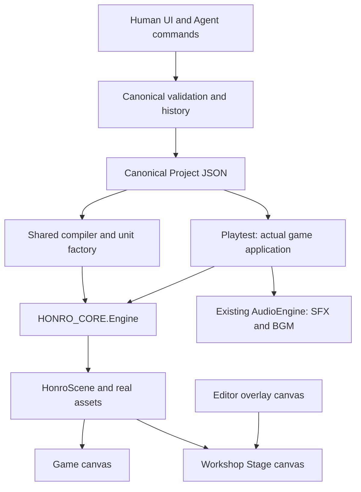

# HONRO 단일 런타임

게임과 편집기는 같은 `HONRO_CORE.Engine`, `HonroScene`, `HonroMaps.createBattle`, `HonroUnits.create`를 호출합니다. Workshop의 별도 Stage 배경·지형·유닛 그림과 간이 플레이 물리는 제거했습니다.

## 빌드 경계

`shared/build.mjs`의 `runtimeParts()`가 유일한 번들 목록입니다. 게임은 여기에 실제 UI·스토리·입력·앱을 추가합니다. Workshop Stage View는 같은 런타임을 쓰고, Playtest는 같은 빌드에서 생성한 **게임 HTML 전체**를 iframe에 넣습니다. 독립 실행을 위해 두 HTML에 코드가 포함되지만 유지보수할 구현은 하나입니다.

## 작성 상태와 실행 상태

Project JSON은 작성 원본입니다. compiler는 원본을 변경하지 않고 Battle을 만들며 엔진은 Battle을 변경합니다. 편집 중에는 실제 Scene을 `dt=0`으로 렌더링하고 별도 canvas에 편집 오버레이를 그립니다. 선택·드래그·스냅은 공통 camera 변환과 geometry를 사용합니다.

인간 편집과 Agent는 같은 Project, `HonroMaps.finalize()` 검증과 undo/redo 히스토리를 사용합니다. 포인터 드래그는 라이브 미리보기 후 하나의 항목으로 저장합니다. Agent preview는 별도 복제본을 실제 Scene에 연결하고 Apply 전 원본을 변경하지 않습니다. Apply는 생성된 ID까지 그대로 반영합니다.

Playtest는 작성 데이터 복제본과 메모리 프로필을 받습니다. Stop은 iframe·오디오를 폐기하고 편집 카메라·선택·도구를 복원합니다. 게임의 JSON 가져오기도 `HonroApp.launchMap`을 사용하며, 테스트 중 저장을 차단하고 종료 시 원래 캠페인 프로필을 복원합니다. 재시도는 가져온 맵을 다시 만듭니다.

## 렌더링·성능·에셋

기존 Scene, art-dark, party v006을 유지합니다. `HonroElements.draw`로 Element Studio·썸네일·게임에 같은 요소를 그립니다. 원본 procedural landmark도 원래 Scene 메서드를 사용합니다. 새 요소의 독립 충돌 폴리곤은 실제 엔진 지형으로 컴파일하며 충돌용 그림은 중복 표시하지 않습니다. 파괴는 `sceneVersion`을 올려 캐시를 갱신합니다.

RC21의 background/static world raster cache, culling, zoom별 raster LOD를 유지합니다. Geometry는 작성 변경 시 컴파일하며 매 프레임 만들지 않습니다. 사용자 명시적 간소화 외에 이관 지형 노드를 줄이지 않습니다. 캐릭터 밸런스·스킬·SFX/VFX·스토리·기본 조작과 저장 revision 20은 유지했습니다. Map version 3은 캠페인 진행 저장 버전과 별개입니다.
