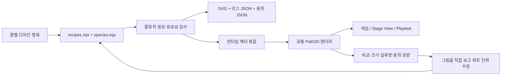

# 몬스터 벡터 제작·시각 검수 계획

현재 단계: **일반 적 11종 게임 적용 + 최초 원본 대비 약 3배 앵커 제한 + 크기별 시각 검토**. 상여·소단 등 특수 보스는 후속 범위다. 기술 통과와 제작자의 시각 검토는 사용자의 미술 승인을 의미하지 않는다.

이 문서는 계속 사용하는 제작 명세다. 실행마다 달라지는 측정·이미지·평가는 `_local/reports/monster-forge/`에 둔다. 현재 패키지에 없는 과거 Forge를 요구하지 않고 이 저장소 안에서 재현한다.

## 목표와 진단

목표는 작은 게임 화면에서도 종·위협·재질·행동이 읽히는 한국형 다크 판타지 몬스터다. 확대했을 때만 정교한 일러스트가 되는 것을 피한다.

기존 `shared/runtime/art-dark.js`는 캔버스 도형을 즉시 그리는 방식이다. 산개의 몸통·다리는 큰 다각형과 굵은 직선, 장승 얼굴은 사각 면 위 꺾인 선, 등불 내부는 사각 빛 덩어리였다. 세부 형태를 편집할 이름 있는 파트와 관절, 제작 데이터, 동일 조건의 비교 화면이 없어 AI가 좌표를 조금씩 고쳐도 개선 여부를 판단하기 어려웠다.

사용자의 후속 지시에 따라 **최초 원본의 약 3배**로 복잡도를 제한한다. 직선에 중간 점을 추가하면 노드는 늘지만 그림은 같으므로 그런 분할은 하지 않는다. 해부 구조·윤곽·재질의 의미 있는 정보에 점을 배정한다. 새 형상의 앵커와 Bézier 제어점을 구분해서 센다. 기존 Canvas의 원/호는 별도 프리미티브로 기록한다. 여기서 앵커는 외곽뿐 아니라 내부 면·재질 경로의 끝점도 포함하며, 제어점과 합산하지 않는다. 경로 수·앵커 수 자체는 미술 점수가 아니다.

`tests/fixtures/monster-baseline.json`은 최초 `art-dark.js`의 파일 해시, 기본 크기와 정지/충전 0에서 측정한 원본 앵커 수를 보관한다. 해당 원본 파일은 `tests/fixtures/monster-art-baseline.js`에 같은 바이트·SHA로 고정했다. HBUG-041의 피격 표시처럼 활성 렌더러가 바뀌어도 비교 원본은 갱신하지 않는다. 이 파일은 검사 입력이며 게임 번들에서 실행하지 않는다. 이전 개선 시안을 새 분모로 삼지 않는다. 생성기는 **2.85~3.15배**를 벗어나면 실패한다. 이는 3배에 대한 ±5% 허용 범위이며 목표를 넘기기 위한 면제 규칙이 아니다.

| 대상 | 최초 원본 | 현재 | 배수 |
|---|---:|---:|---:|
| 산개 | 66 | 204 | 3.09 |
| 장승 | 93 | 284 | 3.05 |
| 등불귀 | 33 | 101 | 3.06 |
| 멧돼지 | 69 | 203 | 2.94 |
| 숫사슴 | 79 | 233 | 2.95 |
| 산박쥐 | 40 | 125 | 3.13 |
| 까마귀 | 47 | 141 | 3.00 |
| 떠도는 혼 | 33 | 98 | 2.97 |
| 수의귀 | 45 | 132 | 2.93 |
| 들린 사람 | 106 | 314 | 2.96 |
| 상두꾼 | 124 | 369 | 2.98 |

기존 3종의 과밀 시안은 산개 379→204, 장승 560→284, 등불귀 234→101로 줄였다. 반복 털선·금줄 꼬임·종이 살·미세 균열을 우선 제거하고 주둥이/턱·장승 표정·내부 혼불은 남겼다. 생성 SVG를 후처리하지 않고 제작 원본에서 파트별 경로를 선별한다.

## 전체 적 제작 순서

현재 일반 적은 `HonroWorld.archetypes`의 11종이며 보스는 별도다. 게임 등장 수치나 역할을 디자인에 맞춰 바꾸지 않는다.

| 단계 | 대상 | 먼저 해결할 형태 문제 | 완료 상태 |
|---|---|---|---|
| 기반 | 제작 스키마·생성기·리그·공통 렌더러·검수 공방 | 좌표·색·동작·검증의 단일 원본 | 구현 |
| 1차 | 산개 | 주둥이/턱, 견갑, 앞뒤 다리 구별, 봉인 흔적 | 3배 기준으로 재수정·적용 |
| 1차 | 장승 | 한국 장승 얼굴, 목주 균열, 뿌리 손, 금줄 | 3배 기준으로 재수정·적용 |
| 1차 | 등불귀 | 고리/대나무 살/한지, 내부 혼불, 긴 꼬리 | 3배 기준으로 재수정·적용 |
| 2차 | 멧돼지·숫사슴 | 체중·발굽·엄니/뿔로 산개와 확실히 구별 | 게임 적용·시각 검토 |
| 3차 | 박쥐·까마귀 | 날개막 대 깃털, 어깨 관절과 날갯짓 극점 | 게임 적용·시각 검토 |
| 4차 | 떠도는 혼·수의귀 | 열린 소매 대 결박된 소매, 매듭과 천의 흐름 | 게임 적용·시각 검토 |
| 5차 | 들린 사람·상두꾼 | 갓/활 대 빈 목깃/상여 들보, 인간 리그 | 게임 적용·시각 검토 |
| 6차 | 상여/소단 등 보스 | 일반 적과 구분되는 비례·층위·공격 전달 | 계획 |

초기 3종으로 동물·조각·부유 물체라는 다른 구조에서 도구가 작동하는지 확인했고, 이제 11종 전체를 같은 계약으로 만든다. 사족·날개·수의·인간의 계열별 도우미를 재사용하되, 색만 바꾸는 방식으로 종을 구별하지 않는다. 특수 보스는 실루엣·연출 명세부터 별도로 작성한다.

## 시각 언어

- 윤곽: 전체를 톱니처럼 만들지 않는다. 귀/갈기/뿌리/찢긴 종이처럼 의미가 있는 곳에만 돌출을 배치한다.
- 명도: 외곽 먹색 → 재질의 어두운 면 → 주 면 → 제한된 밝은 면. 눈·뼈·혼불에 시선을 모으고 장식은 그보다 낮은 대비를 쓴다.
- 색: 숲의 녹회색, 바랜 황토 목재, 뼈·한지색, 적갈색 봉인, 옅은 청록 혼기. 수의는 잿빛 보라, 깃털은 청회색의 역할 팔레트를 사용한다.
- 공유 표식: 금줄, 낡은 부적, 침식·파손. 부적은 창작 봉인 문양이며 실제 문자나 고증된 의례 도형이라고 주장하지 않는다.
- 비대칭: 깨진 귀, 틀어진 치아, 다른 높이의 가지. 구조·관절까지 무작위로 비틀지는 않는다.
- 재질: 털은 몸의 흐름을 따라 짧은 갈래, 목재는 길이 방향 결과 옹이, 종이는 접힌 면과 찢어진 구멍으로 구분한다. 무작위 점을 뿌리는 방식으로 디테일을 채우지 않는다.

현재 참고 자료는 작업 전 게임 도감 화면과 기존 게임의 분위기다. 사용자 제공 이미지나 외부 그림을 입력한 작업이 아니다. 향후 실제 레퍼런스를 사용할 때에는 원본 경로·출처·사용 조건·SHA256·crop 좌표·차용할 구조를 별도로 보관한다.

## 제작 엔진의 범위

범용 벡터 편집기나 새 게임 엔진보다 **이름 있는 파트로 에셋을 만들고 같은 결과를 게임과 검수 화면에 보내는 도구**가 먼저 필요하다.



구현 위치:

| 파일 | 역할 |
|---|---|
| `tools/monster-forge/recipes.mjs` | 공통 도우미·팔레트, 기존 3종의 제작 원본 및 파트별 경로 정리 |
| `tools/monster-forge/species.mjs` | 나머지 8종의 형태·복식·피벗·계열별 동작 원본 |
| `tests/fixtures/monster-baseline.json` | 최초 원본의 해시·앵커·크기 기준. 생성 때마다 갱신하지 않음 |
| `tools/monster-forge/build.mjs` | SVG/JSON/runtime 생성, 계층·경로·트랙 검사, SHA256·용량·복잡도 측정 |
| `shared/assets/monsters/` | 생성된 실제 에셋. 직접 수정하지 않음 |
| `shared/runtime/monster-vector.js` | 캐시한 Path2D, 계층 변환, LOD, 기존 게임 상태 어댑터 |
| `tools/monster-forge/lab.html`, `lab.mjs` | 전용 미술 검수 화면과 빌더 |
| `tests/monster-art-browser.py` | 두 HTML·Playtest, 상태 불변·출력·포즈·성능 검사 및 이미지 생성 |

새 라이브러리 설치나 네트워크 요청이 필요 없다. `shared/build.mjs` 하나의 번들 목록에서 게임·Stage View·Playtest를 생성한다. 공방은 공통 렌더러를 불러오며 별도 물리·전투·맵 루프가 없다. 생성 HTML에 그림을 직접 덧대는 방식도 아니다.

### 에셋 계약

- 좌표: +x가 정면, y=0이 발/기준 위치. `baseHeight`가 월드의 `u.h`로 스케일된다. 몸 밖으로 뻗는 장식은 시각 요소이며 충돌 확대가 아니다.
- 각 에셋: `id`, 이름, 버전, `viewBox`, 팔레트, 디자인 brief, `parts`, `clips`.
- 각 파트: 안정적인 `id`, 부모 `parent`, bind pose의 `pivot`, 화면 뒤에서 앞으로 정렬된 `paths`.
- 각 경로: M/L/Q/C/Z 경로 데이터, 의미 있는 fill/stroke 색 역할, 선 두께, detail 단계. 래스터를 SVG 안에 넣지 않는다.
- 파트 좌표는 공통 bind 공간에 있다. 부모부터 피벗 변환을 적용한 뒤 자식 피벗을 적용한다. 부모가 회전하면 눈·입·부적이 해당 부위와 함께 움직인다.
- 부모가 자식보다 먼저 등장하고 ID가 유일해야 한다. 동작의 파트 참조·채널·키 순서도 생성 시 검사한다.
- 경로는 한 번 생성하고 Path2D로 캐시한다. 프레임마다 경로를 다시 파싱하거나 포즈마다 전체 도형을 복제하지 않는다.
- SVG는 정지 bind pose, JSON은 리그와 동작이며 런타임 묶음은 모두를 함께 가진다. SVG와 게임 출력의 일치도도 검사한다.

### 디테일 단계

| 표시 기준 높이 | 남기는 정보 | 원칙 |
|---|---|---|
| 120px 이상 | 전체 윤곽·면·재질·미세 선 | 확대 검토와 큰 장승 |
| 48~119px | 윤곽·면·얼굴·대표 재질 경계 | 64/96px 및 일반 게임 화면 |
| 48px 미만 | 형태·큰 명암·눈/입의 핵심·프레임 | 축소 맵에서 뭉개짐과 과도한 비용 제한 |

실제 Canvas 변환과 표시 배율에서 픽셀 크기를 얻는다. 초상이나 Workshop 팔레트의 확대도 반영한다. 파트/리그는 그대로이며 작은 선만 생략한다. 현 단계는 고정 경계 전환이므로 줌 경계에서 미세 선이 한꺼번에 나타날 수 있다. 필요하면 다음 단계에서 짧은 명도 보간을 검토한다.

### 동작 계약

대기·이동·공격·피격을 이름 있는 트랙으로 작성했다. 파트별 x/y/회전/스케일 키를 보간한다. 공격 0.56초, 피격 0.3초가 현재 시각 동작 길이다.

게임의 `moving`, `airborne`, `jumping`, `anim`, `hurt`, `facing`을 읽는다. `Engine.fire`가 설정하는 `anim=1`과 피해의 `hurt=.7` 감소값을 동작 진행률로 변환한다. 엔진의 발사·판정 시점은 유지되므로 공방에서 보이는 움츠림은 **발사 이후 표현**이다. 실제 선행 예고 시간이 필요하면 별도 전투 설계로 다뤄야 한다.

정지 상태 사족 3종의 네 발, 장승의 뿌리, 사람·상두꾼의 두 발은 바닥에 고정한다. 이동은 관절 회전 기반의 표현이다. 발끝 월드 좌표를 고정하는 IK, 지면 경사 적응, 동작 전환 블렌딩은 아직 없다. 점프 높이는 유닛의 실제 y를 사용하며 별도 높이를 더하지 않는다. 등불·혼은 시각적으로 흔들리고 날개 두 종은 서로 다른 주기로 날갯짓한다. 들린 사람은 기존 사격 각도의 시각 반응을 유지하며 손과 활이 같은 관절을 따라 움직인다.

일반 적 11종과 해당 종의 `honroMidboss`에 적용한다. `boss`, `honroFinalBoss`, `id='boss'`, 아군·동맹·소환귀는 기존 렌더러를 사용한다. 특히 소단과 일반 궁수는 `honroType='human'`을 공유하므로 타입 하나만으로 교체하면 안 된다.

## 한 종을 만드는 표준 순서

1. **기준 캡처**: 현재 게임에서 같은 적을 같은 크기/배경/시점으로 촬영한다. 이름·타입·variant·실제 h/r·발 기준점·기존 동작을 기록한다.
2. **한 장 명세**: 종을 설명하는 한 문장, 꼭 남길 특징 3개, 재질 2~3개, 금지할 인상, 동작에서 움직일 부위, 예상 표시 크기를 정한다.
3. **검은 실루엣**: 핵심 덩어리와 네거티브 공간만 만든다. 96/64px에서 이전 종과 구별되지 않으면 다음 단계로 가지 않는다. 복수안을 만드는 경우 같은 화면·크기로 비교한다.
4. **구조**: 몸통·골반/목·머리·턱·사지처럼 실제 움직이는 단위로 나눈다. 부위를 가린 상태에서도 관절이 연결될 만큼 여유 면을 남긴다.
5. **명암 3~4단**: 큰 면의 방향과 재질을 먼저 묘사한다. 모든 곳의 대비를 올리지 않는다.
6. **정체성 디테일**: 눈/코/입, 뼈, 부적, 금줄, 파손을 추가한다. 일반 장식보다 종의 특징에 경로를 우선 배정한다.
7. **미세 디테일**: 흐름에 맞는 털/나뭇결/종이 접힘을 추가하고 LOD=2로 분리한다. 기존보다 노드가 적더라도 잘 읽히는 실루엣을 망치면서 숫자를 맞추지 않는다.
8. **동작**: idle, move, attack의 시작/강조/회수, hit를 만든다. 양방향으로 확인한다. 목·손·턱이 분리되거나 바닥이 들리는 프레임을 수정한다.
9. **시각 검토와 수정**: 아래 판정표로 화면을 직접 본다. 문제를 파트 ID·표시 크기·동작 진행률로 기록한 뒤 그 부위만 다시 만든다.
10. **게임 검증**: 독립 도감 통과 뒤 실제 맵·어두운 배경·HUD·선택 외곽선·모바일 크기에서 확인한다. 두 HTML에 같은 결과가 있어야 한다.
11. **재현과 기록**: SVG/JSON/runtime/원본 해시/측정/스크린샷/한계를 저장한다. 게임 반영 시 공통 verify를 통과시킨다.

AI가 다음 종을 만들 때에는 “디테일을 더해라” 대신 “64px에서 머리와 뿔이 합쳐지므로 목과 전방 뿔 사이의 빈 공간을 넓혀라”처럼 화면에서 확인 가능한 수정 지시를 사용한다. 제작자와 검토자의 판단 단계는 분리하되, 별도의 병렬 에이전트가 필요한 구조는 아니다.

## 시각 검수 판정표

다음은 **제작 판단 기준**이다. 아래 숫자를 자동 미술 점수라고 취급하지 않는다. 항목별 0=실패, 1=보완, 2=통과로 기록하며 실루엣·관절·게임 가독성 중 하나라도 0이면 보류한다. 총점만 높아도 치명적인 실패를 상쇄할 수 없다.

| 항목 | 직접 보는 화면 | 실패 예 |
|---|---|---|
| 실루엣 | 96/64px 단색, 양방향 | 산개가 멧돼지처럼 보임, 귀/뿔 소실 |
| 해부/구조 | 256px, 파트 연결 극점 | 사지가 몸통에 붙지 않음, 다리 수가 다르게 읽힘 |
| 얼굴·위협 | 128/96/64px | 눈이 점 하나로 뭉침, 의도와 다른 귀여운 표정 |
| 재질 | 256px 채색/선 보기 | 목재와 털이 같은 빗금 무늬 |
| 초점/대비 | 어두운 숲·바위·밝은 안개 | 금줄이 얼굴보다 밝거나 배경과 같은 명도 |
| 동작 | 0/20/45/70/100%와 재생 | 공격이 안 보임, 부적이 몸에서 떨어짐 |
| 접지 | 고정 지면선, 대기/이동 | 정지 중 발이 뜸, 보행 중 과도한 미끄러짐 |
| 게임 배치 | 실제 게임과 Workshop | HP 바가 얼굴과 겹침, 선택 외곽선 잘림 |

검토 화면은 정지 상태로 열린다. 대상·동작·배경·방향·채색/실루엣/선 보기, 시간 슬라이더와 재생을 제공한다. 검수 메모를 JSON으로 내려받을 수 있다. **현재는 관찰용 공방이며 노드를 마우스로 편집하는 범용 SVG 편집기는 아니다.**

자동 검사와 사람/AI의 이미지 관찰 결과를 별도 기록한다. 기술 PASS를 사용자 미술 승인으로 적지 않는다. 최종적인 분위기·취향·두려움의 정도는 플레이 화면을 본 사용자의 피드백을 받아 다음 시안에서 조정한다.

## 기술 검증과 예산

복잡도 예산은 종별 최초 앵커의 2.85~3.15배다. 몸의 구성에 따라 필요한 파트와 경로 수는 다르므로 모든 종을 같은 개수로 맞추지 않는다. 얼굴·실루엣·큰 재질 면에 우선 배정하고 반복 장식부터 줄인다. 상세 수치는 빌드 때 생성되는 `metrics.json`을 기준으로 삼는다.

- 생성 검사: 파트 중복/부모 참조, 트랙 대상·채널·키 순서, 지원 경로/색 역할, 최초 원본 대비 앵커 범위. 브라우저 검사는 실제 legacy 호출 수와 보관한 기준도 대조한다.
- 정량 비교: 앵커/제어점/경로/색/파트, 단계별 경로 수, SVG 원문/공백 최소화본, 리그/동작/런타임 bytes.
- 렌더 검사: 동일 시각의 결정성, 양방향·네 동작, 화면 영역 내 표시, SVG와 Canvas의 bind pose 일치.
- 상태 보존: 에셋 그리기 전후 유닛/전투 JSON 동일. 기존 저장을 바꾸거나 보정할 필요가 없다.
- 연결: 실제 적 발사·피해로 시각 상태 활성화, 게임·Stage View·Playtest의 같은 sprite 출력, 편집 프로젝트 보존.
- 성능: 다른 브라우저 부하 없이 11종을 섞은 36인스턴스를 120px에서 순차 측정한다. 현 PC p95 16.7ms 미만을 한 기준으로 쓰지만 게임 전체 성능이나 휴대폰 성능을 대체하지 않는다. 전체 verify의 실제 맵 성능도 통과해야 한다.
- 용량: 생성 runtime과 공통 렌더러를 합친 **정확한 추가 bytes**를 측정한다. 동시 작업이 있을 수 있으므로 전체 HTML 전후 차이를 전부 미술 변경의 비용으로 해석하지 않는다. Workshop은 Playtest 사본 때문에 같은 코드가 두 번 포함될 수 있다.

생성 SVG의 현재 최적화는 불필요한 줄바꿈 제거다. 곡선을 과도하게 단순화하는 자동 최적화는 하지 않는다. 임의의 전수 자동추적으로 수천 경로를 만든 결과도 사용하지 않는다.

## 실행

저장소 루트 PowerShell:

```powershell
# 제작 원본에서 두 실제 HTML과 에셋 생성
npm.cmd run build
# 검수 공방 생성 후 두 HTML·Playtest와 미술 회귀 확인
npm.cmd run test:monsters
# 전체 게임 회귀·migration·integration·순차 성능 검사
npm.cmd run verify
```

공방만 다시 만들려면 `node tools/monster-forge/lab.mjs`. `_local/reports/monster-forge/index.html`을 브라우저에서 연다. 게임은 루트 `HONRO.html`, 맵 편집과 Playtest는 `HONRO_WORKSHOP.html`이다.

`roster.png`, `comparison.png`, 종별 `*-sizes.png`/`*-detail.png`/`*-attack.png`, `readability-dark.png`/`readability-light.png`/`readability-silhouette.png`, `wireframes.png`, `game*.png`, `workshop-stage*.png`, `workshop-playtest.png`, `metrics.json`, `browser.json`은 검사로 생성된다. 64/96px 도감은 큰 이미지를 축소하지 않고 실제 픽셀 크기로 직접 그린다. 직접 본 평가는 `VISUAL_REVIEW.md`에 남긴다. 초기 과밀 3종 시안은 `_local/archive/monster-art-v1/`에 보관했다. `_local/`은 Git에서 제외되므로 새 clone에서는 검수 산출물을 다시 생성해야 한다.

## 다음 투자 판단

일반 적 11종에 대한 게임 화면 피드백을 수집하고 특수 보스의 형태 명세를 작성한다. 도구 투자는 실제로 드러난 문제에 따라 다음 순서로 판단한다.

1. 발 미끄러짐이 가장 큰 문제이면 사족 보행용 2관절 IK·접지 디버거.
2. 곡선 좌표 수정이 병목이면 경로/피벗 선택과 좌표 내보내기 기능. 전체 벡터 편집기를 새로 만들기 전에 작은 기능부터 추가한다.
3. 실제 레퍼런스 재현이 필요하면 부위 마스크·제한 팔레트·수정 가능한 곡선 추출을 추가한다. 자동추적은 구조화된 파트를 얻는 보조 수단으로 사용한다.
4. 개체수가 늘어 전체 프레임 비용이 초과하면 재질별 묶기·부분 캐시를 실측한다. 애니메이션을 끄거나 화질을 낮추는 선택을 자동으로 하지 않는다.
5. 생성 모델 이미지가 필요하면 콘셉트/형태 탐색에 쓰고, 최종 게임 경로는 제작 스키마로 재구성한다. 현재 11종에는 생성 이미지가 들어가지 않았다.

그림체는 면을 분할한 벡터 일러스트다. 사실적인 회화 수준, 특수 보스 리디자인, 고급 변형 애니메이션, 모바일 실기기 검증은 후속 범위로 남는다.
